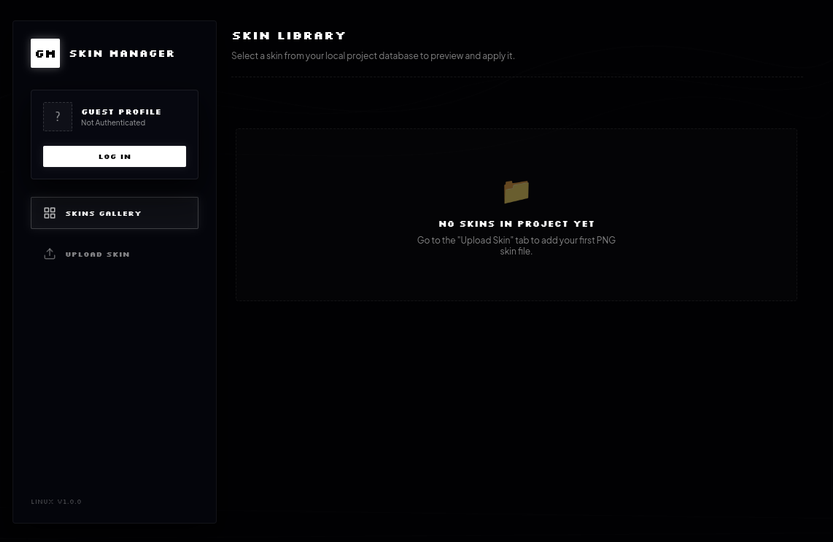

# Global Minecraft Skin Manager

## What it is
A simple tool for Windows and Linux that lets premium Minecraft players manage and change their skins. It has a dark liquid-glass pixel interface.

## How it works
- **Sign in**: Connects to your Microsoft account using official OAuth or device code flows to authenticate with Mojang services.
- **Multiple Accounts**: You can add and switch between different accounts. Each account has its own separate list of skins.
- **3D Preview**: Shows a rotating 3D model of the selected skin so you can see how it looks.
- **Apply Skin**: Updates your skin on premium Minecraft servers directly from the app.

## How to build from source
Make sure you have Node.js and npm installed on your system.

1. Clone this repository and open the folder.
2. Install the required packages:
   ```bash
   npm install
   ```
3. Start the application in development mode:
   ```bash
   npm start
   ```
4. Build portable executables:
   - **Linux AppImage**: `npm run pack:linux`
   - **Windows Portable EXE**: `npm run pack:win`
   - **Both platforms**: `npm run pack:all`


